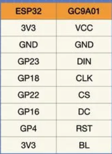
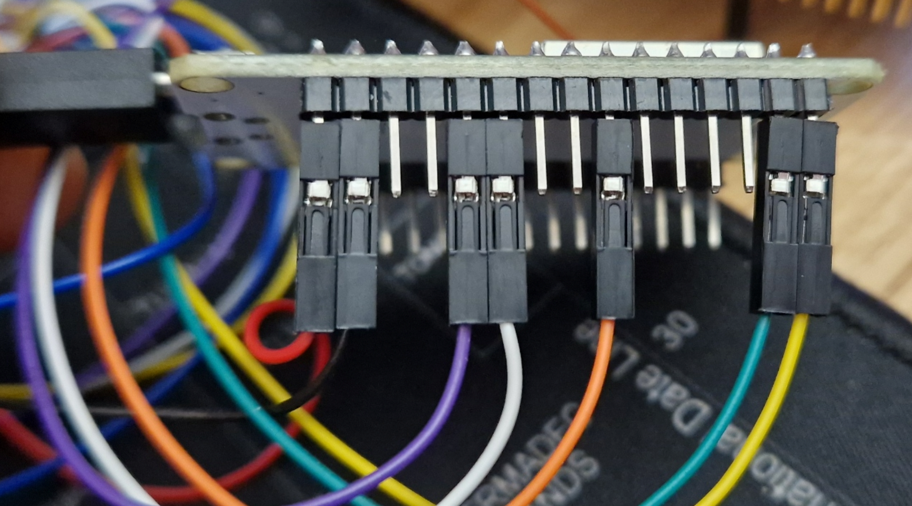

# Waveshare 24155 1.28 inch LCD display demo code port to ESP32 microcontroller

it is a follow up to previous test for this lcd:
[link](https://github.com/kawel/waveshare_24155_demo_on_stm32_ide)

Based on:
[https://dronebotworkshop.com/gc9a01/](https://dronebotworkshop.com/gc9a01/)  

## Hardware

- ESP32 DevKitC - ESP32-DEVKIT V1 from do-it-dev
    
  
- Waveshare 1.28 inch LCD display 240x240 pixels

### connection  

  

## Software

- Arduino IDE
- ESP32 board support
- Adafruit GFX library
- Adafruit GC9A01 library

## Summary

Tis code works much faster than the one written for STM32 by waveshare.
The example does not support touch screen, but it is easy to add it.
